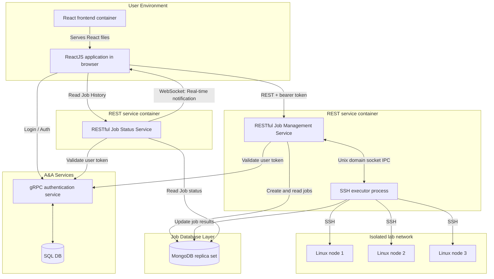
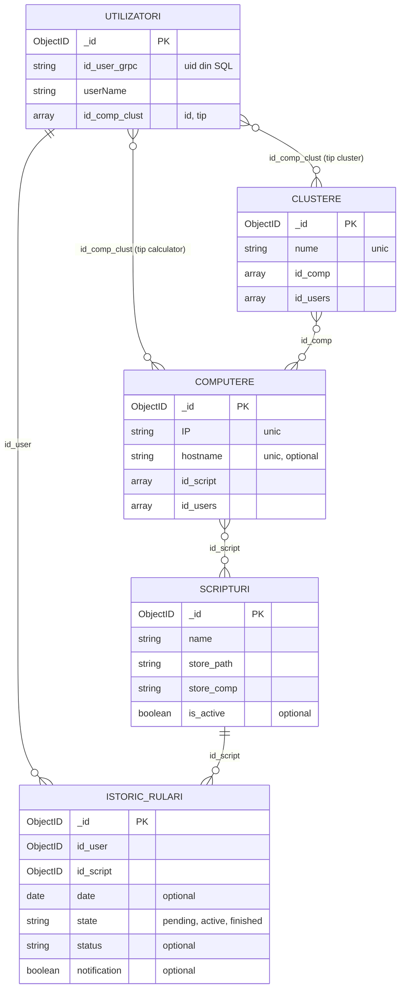

# Arhitectura proiectului

```mermaid
flowchart TB
    subgraph UE [User Environment]
        RFC[React frontend container]
        APP[ReactJS application in browser]
    end
    RFC -- "Serves React files" --> APP

    subgraph JSC [REST service container]
        JS[RESTful Job Status Service]
    end
    APP -- "Read Job History" --> JS
    JS -- "WebSocket: Real-time notification" --> APP

    subgraph JMC [REST service container]
        JM[RESTful Job Management Service]
        SSHX[SSH executor process]
    end
    APP -- "REST + bearer token" --> JM
    JM <-- "Unix domain socket IPC" --> SSHX

    subgraph AA ["A&A Services"]
        AUTH[gRPC authentication service]
        SQL[(SQL DB)]
    end
    AUTH <--> SQL
    APP -- "Login / Auth" --> AUTH
    JM -- "Validate user token" --> AUTH
    JS -- "Validate user token" --> AUTH

    subgraph LAB [Isolated lab network]
        N1[Linux node 1]
        N2[Linux node 2]
        N3[Linux node 3]
    end
    SSHX -- "SSH" --> N1
    SSHX -- "SSH" --> N2
    SSHX -- "SSH" --> N3

    subgraph JDL [Job Database Layer]
        MONGO[(MongoDB replica set)]
    end
    JM -- "Create and read jobs" --> MONGO
    SSHX -- "Update job results" --> MONGO
    JS -- "Read Job status" --> MONGO
```

## Date (MongoDB)

```mermaid
erDiagram
    UTILIZATORI }o--o{ COMPUTERE : "id_comp_clust (tip calculator)"
    UTILIZATORI }o--o{ CLUSTERE : "id_comp_clust (tip cluster)"
    CLUSTERE }o--o{ COMPUTERE : "id_comp"
    COMPUTERE }o--o{ SCRIPTURI : "id_script"
    UTILIZATORI ||--o{ ISTORIC_RULARI : "id_user"
    SCRIPTURI ||--o{ ISTORIC_RULARI : "id_script"

    UTILIZATORI {
        ObjectID _id PK
        string id_user_grpc "uid din SQL"
        string userName
        array id_comp_clust "id, tip"
    }
    COMPUTERE {
        ObjectID _id PK
        string IP "unic"
        string hostname "unic, optional"
        array id_script
        array id_users
    }
    CLUSTERE {
        ObjectID _id PK
        string nume "unic"
        array id_comp
        array id_users
    }
    SCRIPTURI {
        ObjectID _id PK
        string name
        string store_path
        string store_comp
        boolean is_active "optional"
    }
    ISTORIC_RULARI {
        ObjectID _id PK
        ObjectID id_user
        ObjectID id_script
        date date "optional"
        string state "pending, active, finished"
        string status "optional"
        boolean notification "optional"
    }
```
